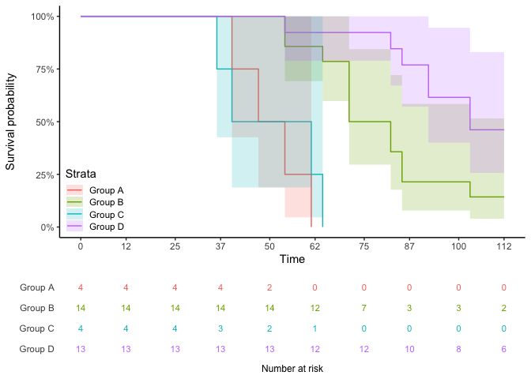
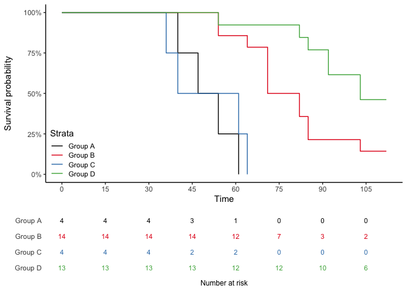

<!-- README.md is generated from README.Rmd. Please edit that file -->

## Install

You can install the latest development version from github:

``` r
devtools::install_github("jbirstler/survivalFigs")
```

By default, vignettes are not created. If you’d like to view vignettes,
install with:

``` r
devtools::install_github("jbirstler/survivalFigs", build_vignettes = TRUE)
```

To learn more about `survivalFigs`, start with the vignette:

``` r
browseVignettes("survivalFigs")
```

## Basic Usage

The main user functions in this package are:

  - `makeKMFig()` which makes a Kaplan-Meier ggplot2 figure
  - `makeNumRiskFig()` which makes a number-at-risk chart as a ggplot2
    figure
  - `combineSurvFigs()` which aligns and combines the two, although they
    can be used separately

<!-- end list -->

``` r
topFigureEx1 <- makeKMFig(
  formula = survival::Surv(stime, scens) ~ treatment,
  data = mice
)
bottomChartEx1 <- makeNumRiskFig(
  formula = survival::Surv(stime, scens) ~ treatment,
  data = mice
)
combineSurvFigs(topFigureEx1, bottomChartEx1)
```



## timepts, colors, and ribbon

Custom `timepts` along the x-axis and `colors` for KM curves or chart
text can be specified in arguments. An optional confidence band `ribbon`
can be displayed.

``` r
topFigureEx2 <- makeKMFig(
  formula = survival::Surv(stime, scens) ~ treatment,
  data = mice, ribbon = TRUE,
  colors = c("black", RColorBrewer::brewer.pal(3, "Set1")),
  timepts = seq(from = 0, to = max(mice$stime), by = 15)
)
bottomChartEx2 <- makeNumRiskFig(
  formula = survival::Surv(stime, scens) ~ treatment,
  data = mice,
  colors = c("black", RColorBrewer::brewer.pal(3, "Set1")),
  timepts = seq(from = 0, to = max(mice$stime), by = 15)
)
combineSurvFigs(topFigureEx2, bottomChartEx2)
```



## Modifying component figures

`makeKMFig()` and `makeNumRiskFig()` both return completely separate
ggplot2 figures which can be modified like any other ggplot2 figure. The
result can be a stand-alone figure or combined with the other component
with `combineSurvFigs()`.

``` r
library(ggplot2)
makeKMFig(formula = survival::Surv(stime, scens) ~ treatment,
          data = mice, ribbon = TRUE) +
  labs(x = "Survival time (days)") +
  theme(legend.position = c(0.1, 0.2),
        legend.background = element_rect(color = "black"),
        panel.grid.major.y = element_line(color = "#DDDDDD"),
        panel.grid.minor.y = element_line(color = "#EEEEEE"))
```


